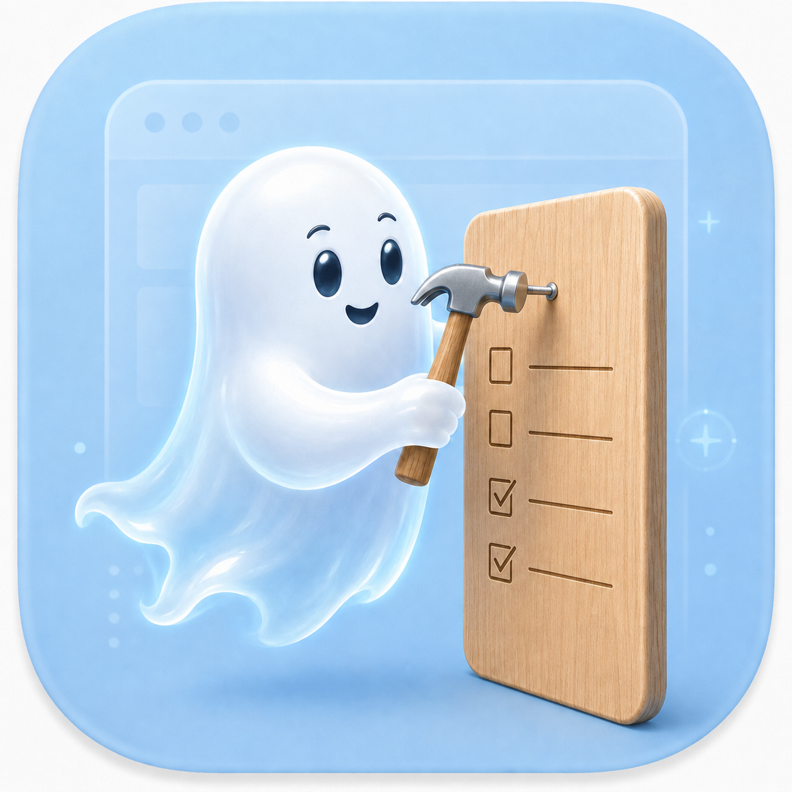

<p align="center">
  
</p>

# GhostPin

**English** · [中文](README.md)

GhostPin is an **Agent-native**, local-first macOS menu bar todo app, with a WPF + Win32 Windows build. On macOS, agents manage tasks through the command-line tool shipped with the app; the app displays a desktop ghost HUD, watches the local file, and sends notifications. Data stays local. Requires macOS 14+ and Swift 6 on macOS.

## Design: Agent Native

GhostPin is a local task panel for agents. The agent reads and changes tasks through the CLI while the app focuses on display and notifications.

```text
User ──natural language──▶ Agent ──ghostpin-cli──▶ todos.json
                                                     │ file watcher
                                                     ▼
                                        ghost HUD / notifications / menu bar
```

- **Writes go through the CLI**: the only UI write action is completing a task on the HUD; creation, editing, deletion, status, priority, due date, and description changes use the CLI.
- **Agents provide absolute time**: reminders and due dates use timezone-aware ISO8601 values; the app does not parse natural-language time.
- **Optional global shortcut (off by default)**: no global shortcut is registered by default; you can record one in Settings → Advanced to toggle passthrough/interactive HUD mode. System-shortcut conflicts are pre-checked and failed registrations are rejected; conflicts with third-party apps cannot be fully detected.
- **Live refresh**: CLI changes appear on the HUD within seconds without restarting the app.

## Features

- Desktop ghost HUD: borderless, always-on-top, adjustable opacity, click-through by default, with persisted position, size, opacity, mode, and scope.
- Read-only HUD display: title, priority, due date, description, and overdue styling; the only interaction is completing a task.
- Menu bar tray: open-task badge, show/hide HUD, interactive mode, settings, and quit; settings include a HUD tab and an Advanced tab (optional global shortcut).
- Local macOS notifications for reminders, with launch-at-login support.
- ghostpin-cli for listing, creating, status changes, updates, deletion, JSON output, and command-level help.
- No accounts, cloud sync, or telemetry.

## Privacy

GhostPin is local-first.

- Tasks are stored at ~/Library/Application Support/GhostPin/todos.json.
- Preferences use macOS UserDefaults.
- The app does not access the network at runtime.

When upgrading from an older version, the first access copies `~/Library/Application Support/TodoPin/todos.json` into the GhostPin directory and keeps the old file as a rollback snapshot. Later writes use only the GhostPin file. Quit the old app before upgrading; if you need to roll back, back up both task files and choose which one to restore manually.

## Installation

Download the latest release asset for your platform from GitHub Releases:

- macOS: `GhostPin-<version>.dmg`; open it and drag GhostPin.app into Applications.
- Windows 11 x64: `GhostPin-<version>-windows-x64.exe`; it is a self-contained single file that runs directly without installing .NET or extracting an archive.

Public macOS builds are currently ad-hoc signed, so macOS may warn that the developer cannot be verified. The Windows EXE is currently unsigned with Authenticode, so Windows SmartScreen may show a security warning.

## Command-line tool

ghostpin-cli is installed inside the app bundle. The user-facing Skill always uses this full path:

/Applications/GhostPin.app/Contents/MacOS/ghostpin-cli

Every command supports -h and --help. To inspect command options:

```bash
/Applications/GhostPin.app/Contents/MacOS/ghostpin-cli --help
/Applications/GhostPin.app/Contents/MacOS/ghostpin-cli update --help
```

Common commands:

```bash
# List open tasks
/Applications/GhostPin.app/Contents/MacOS/ghostpin-cli list --json

# List all tasks
/Applications/GhostPin.app/Contents/MacOS/ghostpin-cli list --all --json

# Create a task
/Applications/GhostPin.app/Contents/MacOS/ghostpin-cli add "Prepare report" --priority medium --due "2026-08-20T18:00:00+08:00" --description "Summarize weekly data" --json

# Change status
/Applications/GhostPin.app/Contents/MacOS/ghostpin-cli doing <id> --json
/Applications/GhostPin.app/Contents/MacOS/ghostpin-cli done <id> --json
/Applications/GhostPin.app/Contents/MacOS/ghostpin-cli undone <id> --json

# Update task fields
/Applications/GhostPin.app/Contents/MacOS/ghostpin-cli update <id> --title "Prepare and send report" --priority high --due "2026-08-21T18:00:00+08:00" --description "Send to the team" --json
/Applications/GhostPin.app/Contents/MacOS/ghostpin-cli update <id> --clear-due --json
/Applications/GhostPin.app/Contents/MacOS/ghostpin-cli update <id> --clear-reminder --json

# Delete a task
/Applications/GhostPin.app/Contents/MacOS/ghostpin-cli delete <id> --json
```

Reminders and due dates must be timezone-aware ISO8601 values. A non-zero exit code means the command failed.

## Build from source

macOS requirements:

- macOS 14+
- Xcode Command Line Tools
- Swift Package Manager

Windows requirements:

- Windows 11 x64
- .NET 10 SDK (including the Windows Desktop SDK)

For day-to-day development, use the Makefile:

```bash
make help                   # Show common commands
make dev                    # Build and start the app
make restart                # Build and restart the app
make stop                   # Stop the app
make logs                   # Start the app and stream logs
make test                   # Run core behavior checks
make cli ARGS='list --json' # Run the development CLI
make package                # Build a DMG or Windows single-file EXE for this platform
```

The underlying scripts are also available:

```bash
swift build
swift run GhostPinCoreChecks
./script/build_and_run.sh --verify
./script/package_dmg.sh
# Windows: PowerShell
./script/package_windows.ps1
```

`make package` detects the current platform: macOS produces `GhostPin-<version>.dmg`, while Windows produces `GhostPin-<version>-windows-x64.exe`. Releases are built by GitHub Actions on macOS and Windows. Update script/VERSION, then run:

```bash
bash script/release.sh
```

For Developer ID distribution:

```bash
GHOST_PIN_SIGN_IDENTITY="Developer ID Application: Your Name (TEAMID)" ./script/package_dmg.sh
```

## Repository layout

```text
Sources/GhostPin/             macOS SwiftUI app
Sources/GhostPinCore/         todo, reminder, parsing, and storage logic
Sources/GhostPinCLI/          ghostpin-cli command-line tool
Sources/GhostPin/Resources/   app icon and logo
Tests/GhostPinCoreChecks/     executable core behavior checks
windows/src/                 Windows WPF + Win32 app and core logic
script/                      app packaging and release scripts
```

## License

GhostPin is released under the MIT License. See LICENSE.
